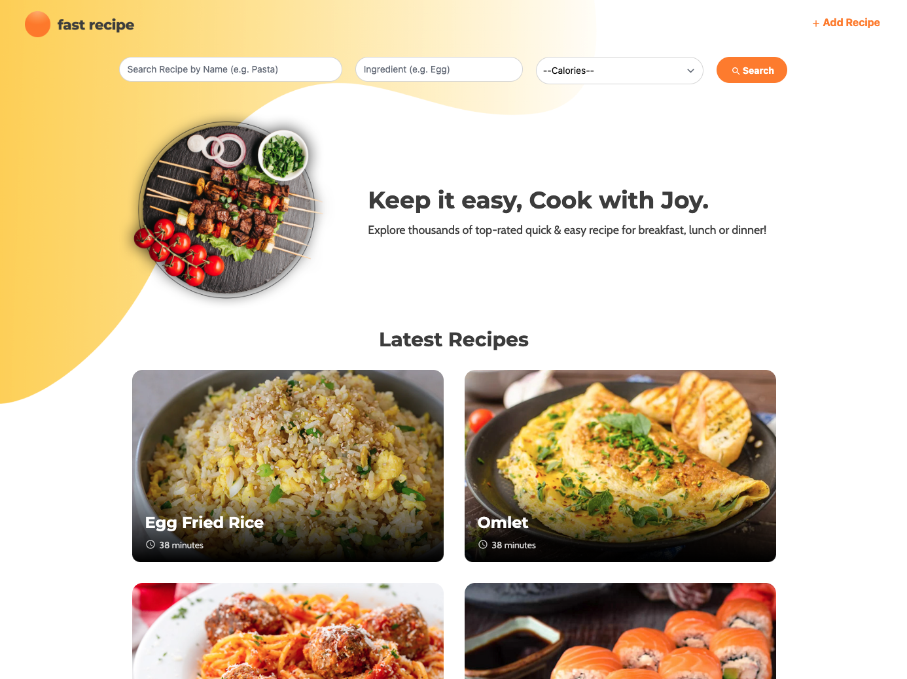
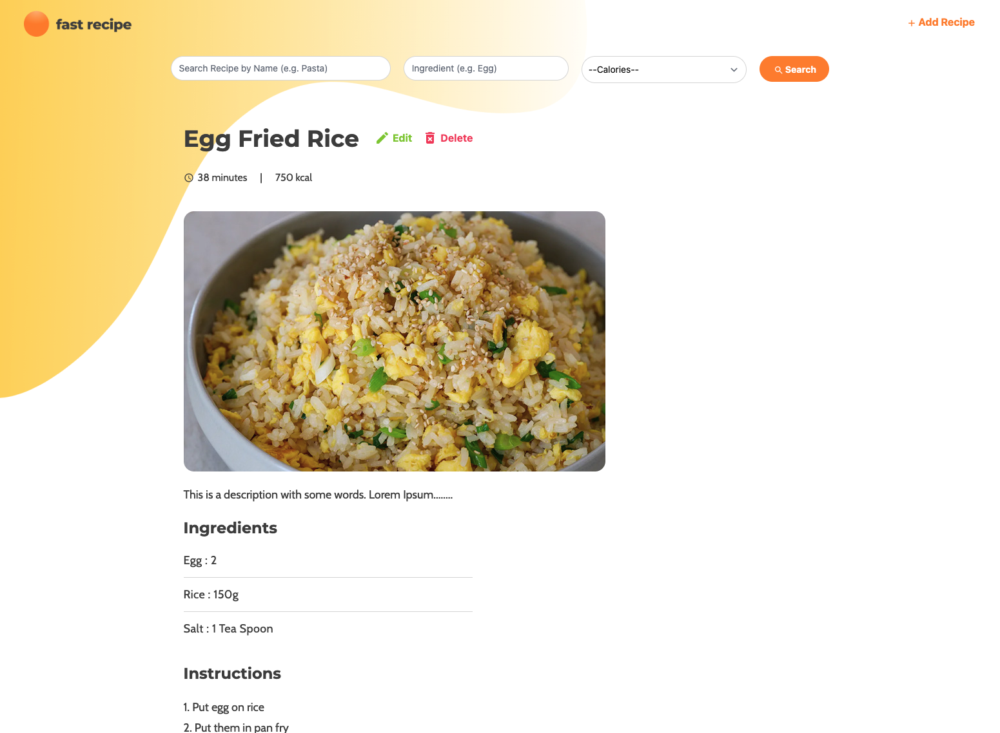

# Getting Started with Fast Recipe

This project was created during my time as a student at Code Chrysalis.

What if there is a way to search for your favorite recipe with only keywords or ingredients, and you can filter out with the calorie value?
Fast Recipe may be your best solution!

Fast Recipe is a web app built by React & Bootstrap.\
You can try the deployed version on:\
[Firebase](https://fast-recipe-react.web.app/)

You can see a video demo on: \
[Video Demo for Fast Recipe](https://youtu.be/X603t6MLHkE)

The backend is supported by API calls to handle the CRUD function for the recipe database.\
Please check my repository at: \
[Recipe API: Find Recipe with Calories or Ingredients](https://github.com/mayl730/ccp4-ipt.api-solo-project-recipe)

## Screen Shots

## Current Features
1. List of Recipes
2. Search the Recipe with keywords/ingredients, and the result can be further filtered with calories.
3. Create a Recipe
4. Edit a Recipe
5. Remove a Recipe
6. Upload an image for a new recipe & change the image for an existing recipe. (Firebase)
7. Image will be automatically compressed before upload.

## Future Release
1. Style the CSS with Tailwind CSS.
2. Login would be required for the Admin features (Add recipes, Edit & Delete recipes) 
3. Bug fix for crashing when accessing recipe-detail or edit directory directly.

## Available Scripts

In the project directory, you can run:

### `npm start`

Runs the app in the development mode.\
Open [http://localhost:3000](http://localhost:3000) to view it in your browser.

The page will reload when you make changes.\
You may also see any lint errors in the console.
